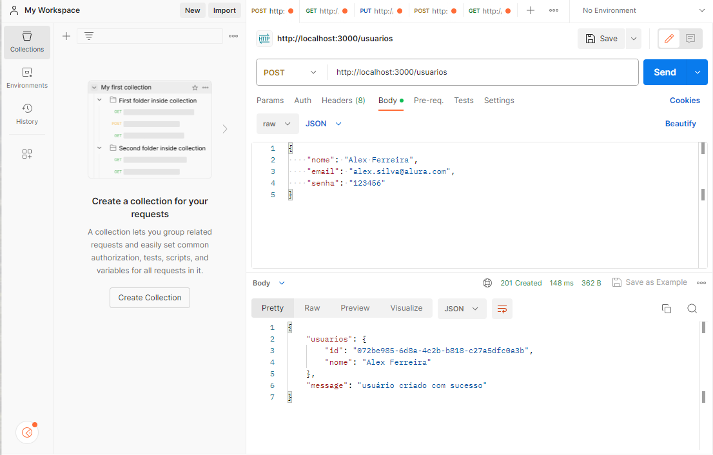
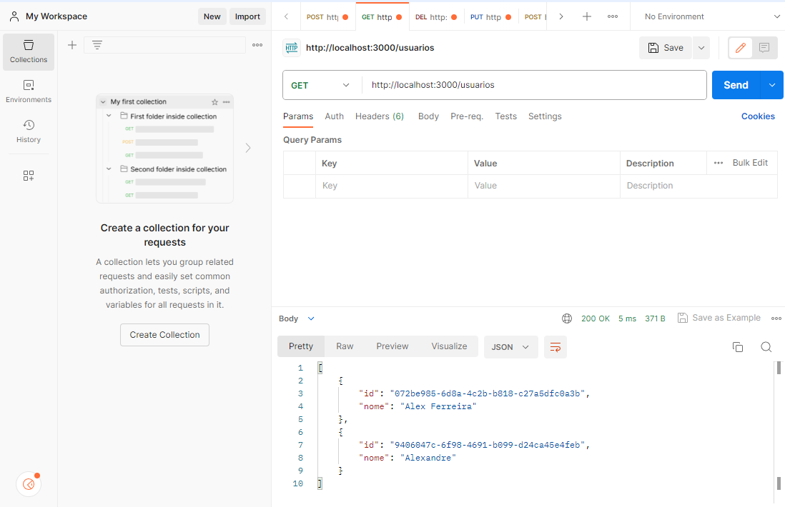
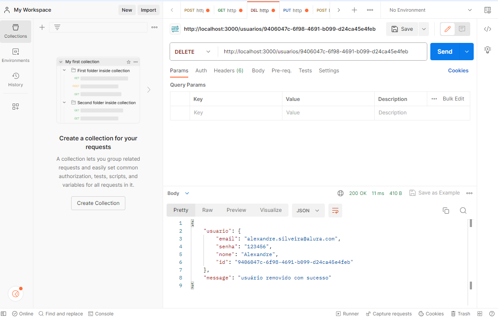

# Cadastro Usuário e Produto
<h1>
    
    
    
</h1>

# Indice

- [Sobre](#-sobre)
- [Tecnologias utilizadas](#-tecnologias-utilizadas)
- [Como baixar o projeto](#-como-baixar-o-projeto)

## 🔖&nbsp; Sobre

O projeto **Cadastro Usuário e Produto** é uma aplicação back-end para cadastro e CRUD do usuário e Produtos em API Restful, foi desenvolvida no curso [Nest.js: criando uma API Restful, Alura](https://cursos.alura.com.br/course/nestjs-criando-api-resftul).

---

## 🚀 Tecnologias utilizadas

O projeto foi desenvolvido utilizando as seguintes tecnologias:

- [Nestjs](https://nestjs.com/)

---

## 🗂 Como baixar o projeto

```bash
    # Clonar o repositório
    $ git clone https://github.com/KellyVasconcellos/API-Restful-nest.js
    # Entrar no diretório
    $ cd API-Restful-nest.js
```

---

Desenvolvido 💜 por Kelly Vasconcellos